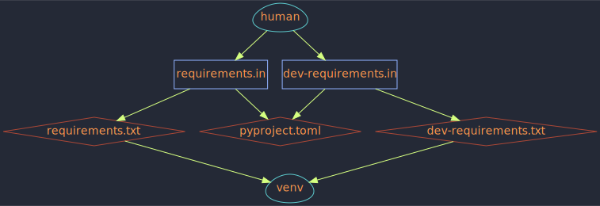

# Introduction

## What?

`zpy` is a set of Zsh functions,
mostly wrapping
[pip-tools](https://github.com/jazzband/pip-tools/),
for the simple and practical management of
Python virtual environments,
dependency specifications,
and isolated Python app installation.

You may find it a suitable alternative to
[poetry](https://python-poetry.org/),
[pipenv](https://pipenv.pypa.io/en/latest/),
[pipx](https://pypa.github.io/pipx/),
or unaided
[pip-tools](https://github.com/jazzband/pip-tools/).

There's a focus on use of good old `requirements.txt` files,
and extensive tab completion assistance.

Read below for some rationale,
or just [get started](start.md) with the short guide.

## Why?

### You may not like something about the way alternatives behave

You may find poetry or pipenv a good fit, and that's ok.
I have personally found them
to conflict with my needs and preferences:

- both introduce new-syntax files
- neither can do what pipx does
- poetry is a bit rigid,
  only working with installable packages as projects
- pipenv is problematically nosy and weird sometimes,
  e.g. using unrelated files above the current folder without consent
- neither fully embrace the rich completions and other features that Zsh offers

I have had only good experience with pipx,
and replacing its features here was not an
initial goal.
I just couldn't resist when
the other functions provided components
for a transparent pipx substitute,
with excellent tab completion.

### `requirements.txt` is good!

The `requirements.txt` format is:

- maximally compatible with basic Python tools (`pip install -r`)
- an "old" standard but recognized by modern tooling as well
- friendly to line-oriented shell tools and manipulation
- simple, readable, concise
- due to all the above, compatible with a heterogeneous dev setup;
  no strict need for all devs to use a single tooling or workflow
- fully capable as a lockfile
- friendly to VCS tracking

### pip-tools is good!

It's a great project and a practical tool.
The model of `requirements.in` `->` `requirements.txt` is strong.
I appreciate its ability to support a variety of practices, without a fight.
There's always more work to do be done there,
so please don't be shy to squash some bugs!

### Zsh is fantastic!

Zsh provides a powerful toolset
for the interactive shell and scripting,
and some unique and beautiful syntax,
and I wanted to explore that.
And the interactive shell seems a proper place from which to coordinate
Python virtual environment related activities.

## Directional Flow of Dependency Specification

While you don't have to be a believer in order to make use of `zpy` functions,
there is a directional flow of data that is expected and supported by their design.

The idea is that dependencies should only be manually edited in `requirements.in` files,
from which `requirements.txt` lockfiles
and `pyproject.toml` files may be generated.

Then virtual environments can be produced or adjusted
to match the `requirements.txt` specifications.

For example:

It's basically the pip-tools model but with `pyproject.toml` as an output rather than input.

But your workflow does not need to match that to make use of many of these functions;
you can also generate lockfiles from
`pyproject.toml`, `setup.cfg`, or `setup.py` files,
or even avoid generating lockfiles altogether.
